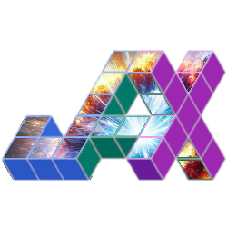

<!--lint ignore double-link-->
# Awesome-JAXtronomy 

<!--lint ignore double-link-->
[JAX](https://github.com/google/jax) brings automatic differentiation and the [XLA compiler](https://www.tensorflow.org/xla) together through a [NumPy](https://numpy.org/)-like API for high performance machine learning research on accelerators like GPUs and TPUs.
<!--lint enable double-link-->

This is a curated list of awesome JAX libraries, projects, and other resources specifically coming from the field of astronomy/astrophysics. Contributions are welcome!

For a broader list of JAX resources, check out the [awesome-jax](https://github.com/n2cholas/awesome-jax) repository.